# Context Prologue 代码仓库结构

> 仓库根目录：`/Users/wondery/paper/Prologue/`
> 项目名：`context-prologue`（pnpm monorepo，TypeScript-only，8 个 workspace packages）
> 状态：仅 RQ1（oracle attribution）端到端实现；RQ2/RQ3/RQ4 接口已定义但无实现

## 三层架构总览

仓库按调用关系分为三层：

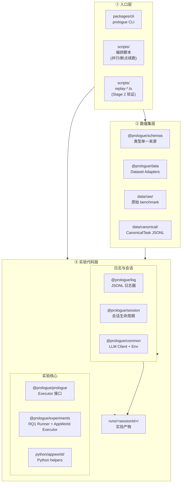

| 层 | 包/目录 | 职责 |
|---|---|---|
| ① 入口层 | `packages/cli`, `scripts/` | CLI 命令 + 实验编排脚本，触发数据构建和实验运行 |
| ② 数据集层 | `packages/schemas`, `packages/data`, `data/` | 定义 CanonicalTask schema + 适配器把原始 benchmark 转为标准化 JSONL |
| ③ 实验代码层 | `packages/prologue`, `packages/experiments`, `packages/common`, `packages/session`, `packages/log`, `python/`, `runs/` | RQ1 ablation 主循环 + AppWorld executor + LLM 客户端 + 日志会话 + Python helpers |

## 包依赖关系

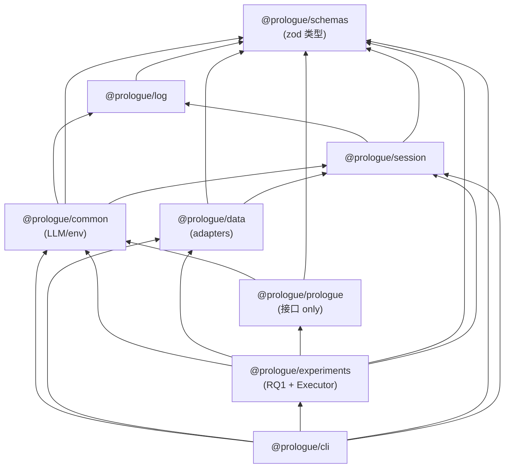

底层 `schemas` 是单一类型来源，所有包向上依赖。`prologue` 是接口包（无实现），具体执行逻辑在 `experiments`。

---

# ① 入口层

入口层提供三类调用方式：CLI 通用入口、编排脚本（实际跑实验用）、回放验证脚本。

## 入口调用流程

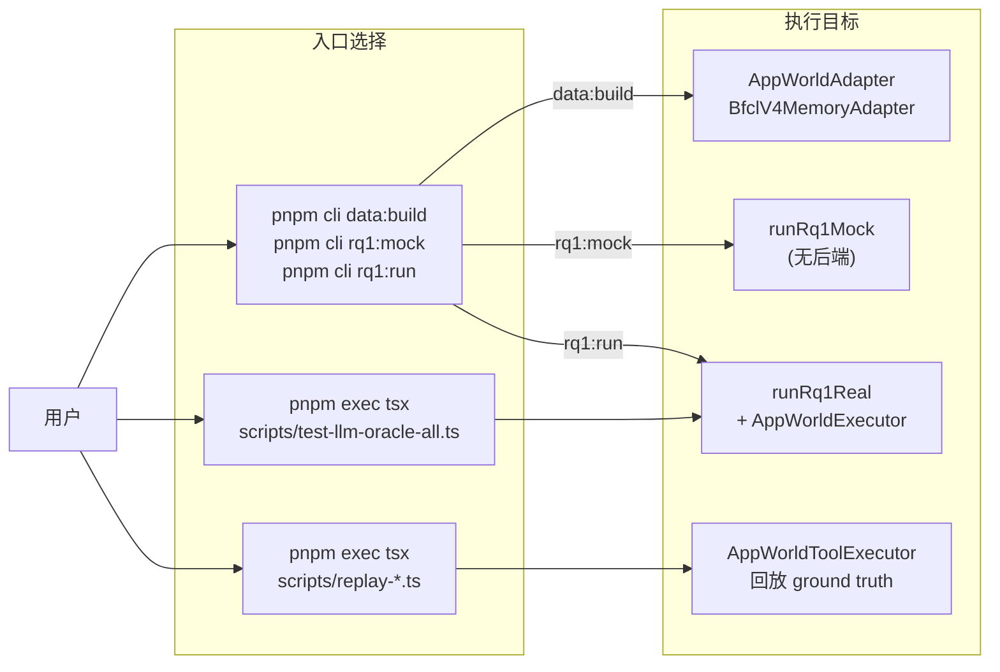

## `packages/cli` — prologue CLI

**路径**：`packages/cli/src/index.ts`（293 行）
**binary**：`prologue` → `dist/index.js`

| 命令 | 用途 | 关键参数 |
|---|---|---|
| `data:build` | 跑 adapter，产出 CanonicalTask JSONL + manifest | `--source appworld/bfcl_v4_memory` `--raw <path>` `--out <path>` |
| `rq1:mock` | 跑 mock RQ1（无 LLM，无后端；success = `usesOracleMemory && usesOracleTool`） | `--tasks <canonical.jsonl>` |
| `rq1:run` | 跑真实 RQ1，配 `AppWorldExecutor` | `--tasks` `--llm-provider` `--llm-model` `--max-steps` 等 |

**路径解析**：相对路径基于 `INIT_CWD`（pnpm 注入），任意目录都能跑 `pnpm cli`。

## `scripts/` — 顶层编排脚本（实际跑实验的入口）

| 脚本 | 行数 | 用途 |
|---|---|---|
| `test-llm-oracle-all.ts` | 443 | **主 RQ1 LLM 实验驱动器**。支持 `appworld-batch_a_train.jsonl`（90 task）或 `appworld-batch_a.jsonl`（147 task）。自实现 worker pool（`runConcurrency: 10`）、checkpoint、断点续跑（`resumeValidFrom`）、provider_error/executor_error 分类、汇总打印 |
| `test-bfcl-llm-oracle-all.ts` | - | BFCL V4 主实验驱动器。465 tasks × 8 conditions = 3720 runs |
| `test-bfcl-adapter.ts` | - | BFCL adapter 结构验证（53 checks）|
| `test-bfcl-stub-attribution.ts` | - | BFCL stub agent 8-condition 归因矩阵验证 |
| `analyze-rq1-results.ts` | 230 | RQ1 结果分析脚本。从 session.json 读取 trajectories，按 condition 统计 mean/median/min/max/success，计算 delta vs baseline、交互效应（synergy/antagonism）、per-task 分布、step count 效率 |
| `replay-ground-truth.ts` | 228 | Stage 2 验证（5-task sample）。加载 canonical，每 task 启 AppWorld server，回放 `api_calls.json` 到 `AppWorldToolExecutor`，验证全部成功。无 LLM |
| `replay-batch-a-sample.ts` | 173 | Stage 2 验证（全 A 批）。从 `/tmp/replay-targets.json` 读目标，覆盖 sample_5 未覆盖的多 app / path+body 场景 |

**`test-llm-oracle-all.ts` 关键配置**：
- `llmProvider: "siliconflow"`（本地开发）/ `"vllm"`（服务器）/ `"dashscope"`（阿里云）
- `llmModel: "Qwen/Qwen3.5-27B"`
- `maxSteps: 800`, `maxTokens: 4096`, `enableThinking: false`
- `rpm: 1000`, `apiMaxConcurrency: 50`, `runConcurrency: 10`
- `basePort: 9100`, `checkpointEvery: 50`
- `resumeValidFrom`: 支持从指定 session 的 checkpoint.json 恢复，跳过 valid runs，重跑 executor_error/provider_error
- `appworldRoot` / `pythonPath` 支持环境变量（`PROLOGUE_APPWORLD_ROOT` / `PROLOGUE_APPWORLD_PYTHON`）
- 错误分类：`LlmCallError` → `provider_error`（API 提供商错误），其他 → `executor_error`（AppWorld server/Python 错误）

---

# ② 数据集层

数据集层定义统一的 `CanonicalTask` schema，并通过 adapter 把不同 benchmark 的原始数据转为这个格式。

## 数据集层结构

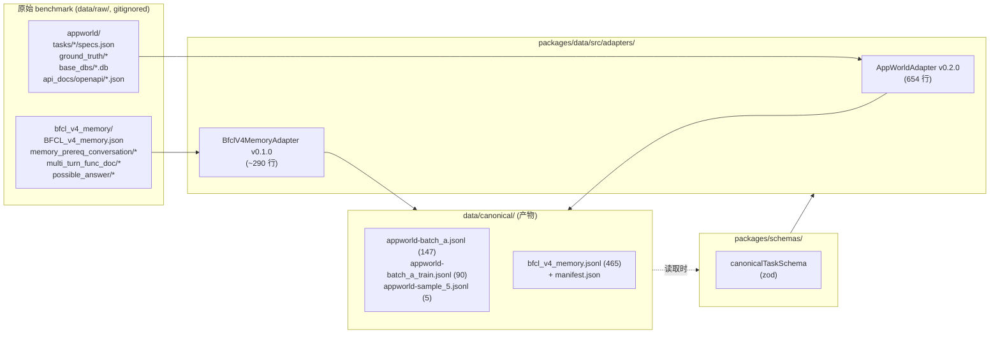

## `packages/schemas` — 类型单一来源

**路径**：`packages/schemas/src/index.ts`（165 行）
**依赖**：`zod ^3.24.1`（唯一外部依赖）

定义所有数据形状的 Zod schema + 推断 TS 类型，其他包只 import 不重复定义。

**关键导出**：

| 类型 | 用途 |
|---|---|
| `CanonicalTask` | 标准化任务格式（见下方） |
| `MemoryItem` | `{id, type, content, source?, timestamp?, metadata}` |
| `ToolItem` | `{id, name, description, schema?, type, metadata}` |
| `EvaluatorSpec` | `{type, entrypoint?, goldAnswer?, metadata}` |
| `DatasetCapability` | `{hasOracleIntent/Memory/Tool, hasExecutableEval, supportsInteraction}` |
| `DatasetManifest` | 数据集元信息 |
| `VerifierExample` | RQ3 verifier 训练样本（接口已定义，无实现） |
| `LogEvent`, `TrajectoryStep`, `AgentTrajectory`, `SessionFile` | 日志与会话（见 ③ 日志层） |
| `Rq`, `Split`, `MissingType` | 枚举 |

### CanonicalTask 格式

```json
{
  "taskId": "50e1ac9_1",
  "source": "appworld",
  "domain": "spotify",
  "split": "dev",
  "query": "原始用户 query（主方法唯一可读的输入字段之一）",
  "oracleIntent": "<query + 操作约束（仅 oracle 条件注入）>",
  "memoryPool": [
    {"id":"...:memory:supervisor_profile","type":"profile","metadata":{"memoryRole":"common"}},
    {"id":"...:memory:public_data","type":"evidence","metadata":{"memoryRole":"oracle"}},
    {"id":"...:memory:distractor:...","metadata":{"memoryRole":"distractor"}}
  ],
  "commonMemoryIds":   ["...:memory:supervisor_profile"],
  "oracleMemoryIds":   ["...:memory:public_data"],
  "distractorMemoryIds":["...:memory:distractor:..."],
  "toolPool":     [{"id":"supervisor__show_profile","name":"...","type":"api","schema":{...}}],
  "oracleToolIds":["supervisor__show_profile","spotify__login","..."],
  "evaluator": {"type":"programmatic","entrypoint":"appworld:evaluate","goldAnswer":"..."},
  "capabilities": {"hasOracleIntent":true,"hasOracleMemory":true,"hasOracleTool":true,"hasExecutableEval":true,"supportsInteraction":true},
  "metadata": {"adapterVersion":"0.2.0","rawTaskId":"...","requiredApps":["spotify"],"...":"..."}
}
```

**关键约束**：主方法只能访问 `query + memoryPool + toolPool`；`oracleIntent / oracleMemoryIds / oracleToolIds` 仅用于 oracle 归因、标签构造、评估。

## `packages/data` — Dataset Adapters

**路径**：`packages/data/src/`
**依赖**：`@prologue/schemas`, `@prologue/session`

**核心接口**：

```ts
export interface DatasetAdapter {
  readonly source: string;
  readonly version: string;
  convert(rawRoot: string): AsyncIterable<CanonicalTask> | Iterable<CanonicalTask>;
}
```

**辅助函数**：
- `writeCanonicalTasks(tasks, outPath)` — 逐条 `canonicalTaskSchema.parse` 校验后写 JSONL
- `readCanonicalTasks(path)` — 读 JSONL 并 parse
- `writeDatasetManifest` / `buildDatasetManifest`

### 已实现 Adapters

#### `AppWorldAdapter` v0.2.0（`adapters/appworld.ts`，654 行）

**输入**：`data/raw/appworld/`，包含 `tasks/<task_id>/`（specs.json + ground_truth/*）+ `base_dbs/` + `api_docs/openapi/`

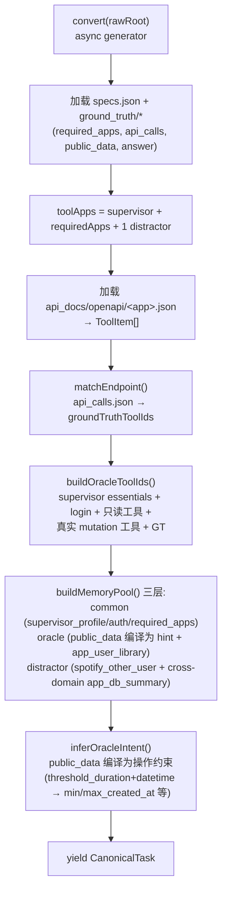

**关键设计**：
- `oracleToolIds` 是 "tool closure"：保证 oracle 条件下任务可解，但不直接给 ground truth（保留推理空间）
- 三层 memory layering（common / oracle / distractor）对应 RQ1 的 baseline / oracle / 干扰对照
- `inferOperationalHints` 把抽象约束（如 `threshold_duration: "month"`）编译成具体操作（具体日期范围）
- SQLite 访问用 `sqlite3 -json` CLI（不是 Node sqlite 库）

#### `BfclV4MemoryAdapter` v0.1.0（`adapters/bfcl_v4_memory.ts`，~290 行）

**输入**：`data/raw/bfcl_v4_memory/`，包含：
- `BFCL_v4_memory.json`（155 测试问题，NDJSON：id / question / scenario / involved_classes）
- `memory_prereq_conversation/memory_<scenario>.json`（5 scenarios，每个 4-10 段渐进式对话，用于预填充 memory）
- `multi_turn_func_doc/memory_{kv,vector,rec_sum}.json`（3 backends 共 32 个 memory operation 函数）
- `possible_answer/BFCL_v4_memory.json`（155 ground truth：id / ground_truth[] / source）

**BFCL V4 Memory 三组件映射**：

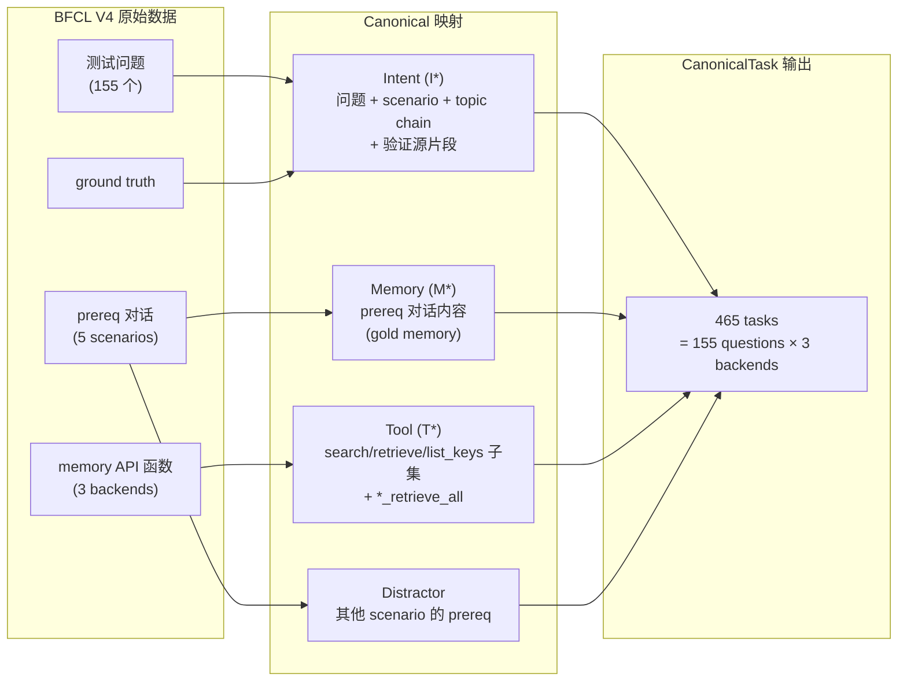

**关键设计**：
- 每个 question × backend = 一个 CanonicalTask（465 = 155 × 3）
- 测试时模型只能看 memory state（看不到 prereq 对话历史）—— 正好对应 M* oracle 注入
- 三层 memory：common（scenario profile）/ oracle（prereq 对话）/ distractor（其他 scenario 对话）
- `oracleToolIds` = retrieve/search/list_keys 子集 + `*_retrieve_all`（baseline 必须瞎猜 key，oracle 给 `retrieve_all` 提示）
- evaluator: `exact_match`，goldAnswer 含 ground truth 候选列表
- `supportsInteraction: false`（BFCL memory 是单轮测试：问题 → 答案）

**验证产出**：
- `data/canonical/bfcl_v4_memory.jsonl`（465 tasks，40 MB）
- `data/canonical/bfcl_v4_memory.manifest.json`
- 分布：customer 30 / finance 25 / healthcare 25 / notetaker 25 / student 50（每 scenario × 3 backends）

## `data/` 目录布局

```
data/
├── raw/                    ← 原始 benchmark（gitignored）
│   ├── appworld/           ← AppWorld 官方数据包
│   │   ├── data/tasks/<task_id>/ (specs.json, ground_truth/*, dbs/*)
│   │   ├── data/base_dbs/  (12 sqlite)
│   │   ├── data/api_docs/openapi/<app>.json (10 spec)
│   │   ├── data/datasets/  (train/dev/test_normal/test_challenge.txt)
│   │   ├── sample/         (2-task sample)
│   │   ├── sample_5/       (5-task A-batch sample)
│   │   ├── batch_a/        (147-task manifest)
│   │   └── batch_a_train/  (90-task train manifest)
│   └── bfcl_v4_memory/     ← BFCL V4 memory 数据
│       ├── BFCL_v4_memory.json (155 questions)
│       ├── memory_prereq_conversation/memory_*.json (5 scenarios)
│       ├── multi_turn_func_doc/memory_*.json (3 backends)
│       └── possible_answer/BFCL_v4_memory.json (155 answers)
├── canonical/              ← adapter 产出的 CanonicalTask JSONL
│   ├── appworld-batch_a.jsonl (147 tasks)
│   ├── appworld-batch_a_train.jsonl (90 tasks)
│   ├── appworld-sample_5.jsonl (5 tasks)
│   ├── bfcl_v4_memory.jsonl (465 tasks) + .manifest.json
│   └── ...
└── examples/               ← 手写 schema demo（非真实实验）
    ├── canonical-tasks.jsonl
    ├── verifier-examples.jsonl
    └── ...
```

---

# ③ 实验代码层

实验代码层包含两个子模块：**实验核心**（RQ1 ablation 主循环 + Executor）和**日志记录**（日志器 + 会话生命周期 + LLM 客户端）。

## 实验代码层内部结构

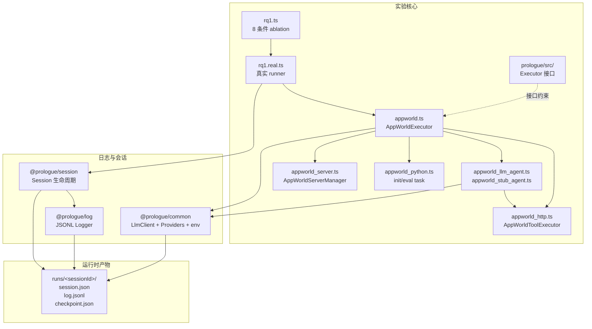

---

## ③-A 实验核心

### RQ1 八条件 Ablation

**路径**：`packages/experiments/src/rq1.ts`（216 行）

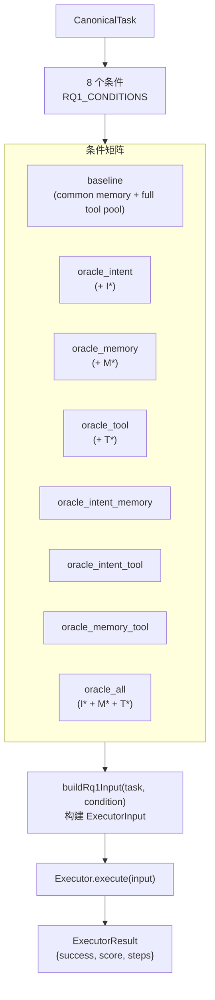

**8 条件 → Oracle 标志**：

| condition | I | M | T | 说明 |
|---|---|---|---|---|
| `baseline` | - | - | - | 只给 common memory + 全工具池 |
| `oracle_intent` | ✓ | - | - | 注入 oracleIntent |
| `oracle_memory` | - | ✓ | - | common + oracle memory |
| `oracle_tool` | - | - | ✓ | 只给 oracleToolIds 子集 |
| `oracle_intent_memory` | ✓ | ✓ | - | I + M |
| `oracle_intent_tool` | ✓ | - | ✓ | I + T |
| `oracle_memory_tool` | - | ✓ | ✓ | M + T |
| `oracle_all` | ✓ | ✓ | ✓ | 三组件全 oracle（上限） |

**`buildRq1Input(task, condition)` 关键逻辑**：

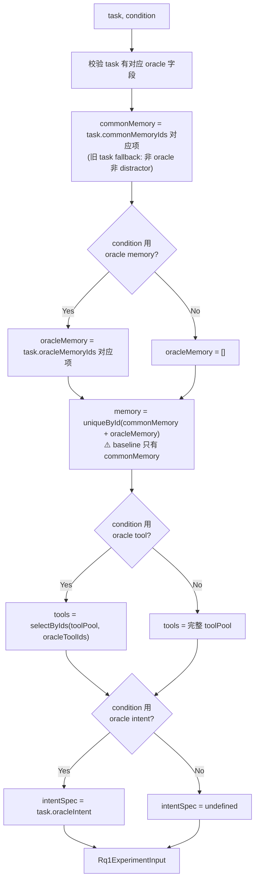

**关键 bugfix（2026-07-19）**：baseline 之前误用整个 `memoryPool`，现修正为只取 `commonMemory`，保证 baseline 与 oracle_memory 之间的差值确实反映 oracle memory 的边际贡献。

### Runner

| 文件 | 用途 |
|---|---|
| `rq1.ts` | 定义 `RQ1_CONDITIONS`、`buildRq1Input`、`runRq1Mock`（mock success = `usesOracleMemory && usesOracleTool`，无后端，仅校验逻辑） |
| `rq1.real.ts`（128 行） | `runRq1Real(tasks, session, executor)` — 委托给 `Executor.execute`，写 `task_start`/`oracle_condition`/`eval_result` log event，加 trajectory，返回 per-condition 汇总。单次 (task, condition) 失败不中断整体运行 |

### `@prologue/prologue` — 接口包（无实现）

**路径**：`packages/prologue/src/`

定义抽象接口，具体实现位于 `@prologue/experiments`：

```ts
// index.ts
export type PrologueContext = { intent: string; memory: MemoryItem[]; tools: ToolItem[] };
export type VerifierOutput = { score: number; missing: "intent"|"memory"|"tool"|"multiple"|"none" };
export interface IntentClarifier { ... }
export interface MemoryGater { ... }
export interface ToolSelector { ... }
export interface SufficiencyVerifier { verify(task, context): Promise<VerifierOutput>; }

// executors.ts
export interface ExecutorInput {
  taskId, source, query,
  intentSpec?, memory: MemoryItem[], tools: ToolItem[],
  condition?, usesOracleIntent/Memory/Tool: boolean
}
export interface ExecutorResult { success, score?, reason?, steps, metadata? }
export interface Executor { execute(input): Promise<ExecutorResult>; }
export interface ToolExecutor { call(tool, args): Promise<ToolCallResult>; }
```

**状态**：所有接口 only，没有任何具体实现类。Sufficiency Verifier（RQ3）整块是 future work。

### `AppWorldExecutor` — 单次执行生命周期

**路径**：`packages/experiments/src/executors/appworld.ts`（237 行）

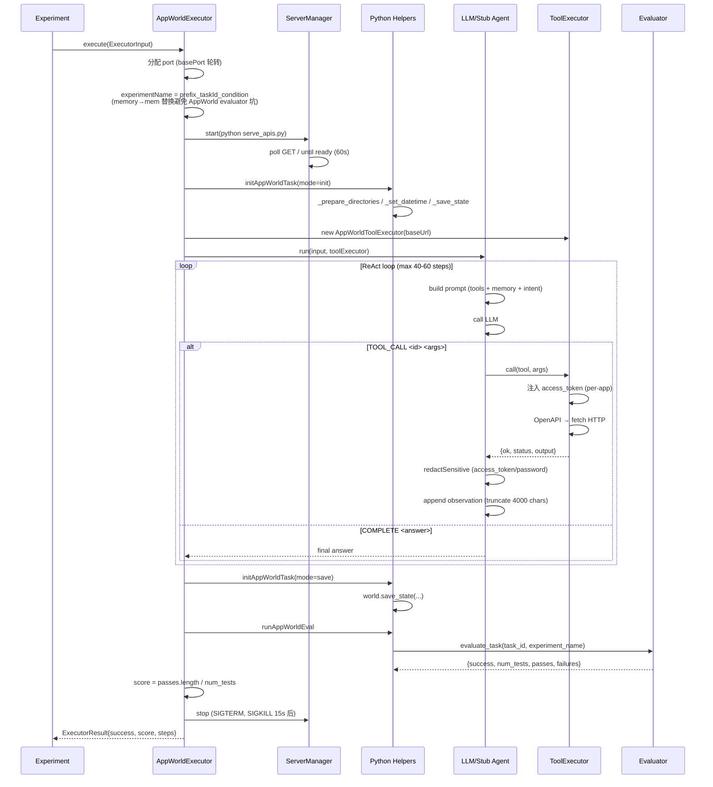

**关键设计**：
- 单次执行失败不影响其他 run（不抛异常，返回 `success: false`）
- `experimentName` 中 `memory` → `mem` 替换：AppWorld evaluator 把路径含 `memory` 的当作 in-memory connection string
- per-app `access_token` 隔离：避免 LLM 从 history 复制错 app 的 token
- `redactSensitive`：递归 scrub `access_token`/`authorization`/`password` 为 `[REDACTED]`

### AppWorld Executor 子模块

| 文件 | 行数 | 职责 |
|---|---|---|
| `appworld.ts` | 237 | `AppWorldExecutor` 编排：port 分配 → server → init → agent → save → eval → stop |
| `appworld_http.ts` | 154 | `AppWorldToolExecutor`：OpenAPI → fetch，per-app token 存储（`tokensByApp`），auth 注入 |
| `appworld_server.ts` | 127 | `AppWorldServerManager`：管理 `python serve_apis.py` 子进程，poll `GET /` 就绪，SIGTERM 关闭 |
| `appworld_python.ts` | 159 | `initAppWorldTask`（mode: init/save）+ `runAppWorldEval`，subprocess + stdin/stdout JSON |
| `appworld_llm_agent.ts` | 343 | `LlmAppWorldAgent`：ReAct 风格，文本协议 `TOOL_CALL <id> <json>` / `COMPLETE <answer>`，token 隔离 + redaction |
| `appworld_stub_agent.ts` | 313 | `StubAppWorldAgent`：无 LLM，从 oracle memory 推导答案；仅 `usesOracleMemory===true` 时有答案；跑固定 7-call 序列保 trajectory 完整 |

### Agent 响应协议（`LlmAppWorldAgent`）

```
TOOL_CALL <tool_id> <json_args>   ← 调用工具
COMPLETE <answer>                  ← 提交最终答案
```

- 默认 `maxSteps=200`, `maxTokens=1024`, `temperature=0.3`, `enableThinking=false`
- prompt 强化：每条响应必须以 `TOOL_CALL` 或 `COMPLETE` 起始，禁止自然语言前置
- 工具输出截断 4000 字符
- 若 `maxSteps` 耗尽仍未 `COMPLETE`，尝试 `supervisor__complete_task` 提交最后一个 answer

### `python/appworld/` — Python Helpers

3 个薄包装，均通过 stdin/stdout 传 JSON，需在 `.venv-appworld/` 跑。**每个 task 必须新进程**：AppWorld 持有 process-level DB cache。

| 文件 | 行数 | 用途 |
|---|---|---|
| `serve_apis.py` | 22 | 包装 `appworld.serve.apis.run`，参数 `--root --port`，长驻进程，TS 父进程 SIGTERM 关闭 |
| `init_task.py` | 71 | `mode="init"` 跑 `_prepare_directories` / `_execute_preamble` / `_set_datetime` / `_save_state`（手工跳过 `close_all()` 避免 time_freezer bug）；`mode="save"` 跑 `world.save_state(...)` 持久化 DB 变更 |
| `eval_task.py` | 39 | 调 `appworld.evaluate_task(...)`，输出 `tracker.to_dict()`（`success, difficulty, num_tests, passes, failures`） |

---

## ③-B 日志与会话

### `@prologue/session` — 会话生命周期

**路径**：`packages/session/src/index.ts`（66 行）
**依赖**：`@prologue/log`, `@prologue/schemas`

每次实验创建 `<runsRoot>/<sessionId>/` 目录，持久化 `session.json`，挂载 logger。

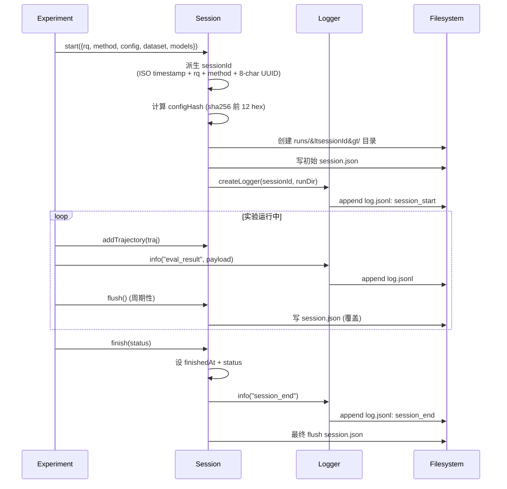

**sessionId 格式**：`2026-07-20T03-51-09-419Z_rq1_oracle_attribution_llm_a_train_1a1af548`

### `@prologue/log` — JSONL 日志器

**路径**：`packages/log/src/index.ts`（44 行）
**依赖**：`@prologue/schemas`

Append-only JSONL logger，每行一个 `LogEvent`，写入 `<runDir>/log.jsonl`。

**LogEvent 结构**：

```ts
{
  eventId: string,    // randomUUID()
  sessionId: string,
  timestamp: string,  // ISO
  level: "debug" | "info" | "warn" | "error",
  type: string,       // "session_start" | "task_start" | "oracle_condition" | "eval_result" | "executor_error" | "session_end" | ...
  rq?: "rq1"|"rq2"|"rq3"|"rq4",
  taskId?: string,
  source?: string,
  method?: string,
  payload: unknown
}
```

**导出**：`Logger` 类（`debug/info/warn/error(type, payload)`）+ `createLogger(sessionId, runDir)`

### `@prologue/common` — LLM Client + Providers + Env

**路径**：`packages/common/src/`
**依赖**：`@prologue/log`, `@prologue/schemas`, `@prologue/session`, `dotenv ^16.4.7`

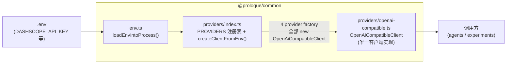

**5 个内置 provider**：

| Provider | Base URL | Env Var | 说明 |
|---|---|---|---|
| `siliconflow` | `https://api.siliconflow.cn/v1` | `SILICONFLOW_API_KEY` | 硅基流动 |
| `openai` | `https://api.openai.com/v1` | `OPENAI_API_KEY` | OpenAI |
| `dashscope` | `https://dashscope.aliyuncs.com/compatible-mode/v1` | `DASHSCOPE_API_KEY` | 阿里云通义（Qwen 系列） |
| `deepseek` | `https://api.deepseek.com/v1` | `DEEPSEEK_API_KEY` | DeepSeek |
| `vllm` | `http://localhost:4000/v1`（可 `VLLM_BASE_URL` 覆盖） | `VLLM_API_KEY`（可选，默认 `"EMPTY"`） | 本地 vLLM 服务器 |

**`OpenAiCompatibleClient` 关键特性**：
- 内置 `RateLimiter`（RPM + maxConcurrency，setTimeout 队列）
- 重试：指数退避，HTTP 429 退避更长
- `enable_thinking` 标志（Qwen 思考模式）
- 默认：timeout 120s，3 次重试，RPM 500，并发 20
- 错误分类：`PERMANENT_ERROR_CODES`（invalid_api_key 等，不重试）vs `TRANSIENT_RATE_LIMIT_CODES`（rate_limit_exceeded / limit_burst_rate / insufficient_quota 等，429 重试）
- **关键修复（2026-07-21）**：`insufficient_quota` 从 `PERMANENT_ERROR_CODES` 移到 `TRANSIENT_RATE_LIMIT_CODES`。DashScope 用 `HTTP 429 + insufficient_quota` 表示临时 TPM 限制（应重试），不是永久配额耗尽。修复前并发 5+ 时 429 被误判为永久错误导致不重试、全部 EXECUTOR_ERROR
- 导出接口：`LlmClient`（`call(input): Promise<LlmCallOutput>`）

## `runs/` — 实验产物

**路径**：`runs/`（gitignored）

每个 run 创建 `<ISO-timestamp>_<rq>_<method>_<8-char-uuid>/`：

```
runs/2026-07-20T03-51-09-419Z_rq1_oracle_attribution_llm_a_train_1a1af548/
├── session.json        # 完整 SessionFile (config/dataset/models/trajectories)
│                       # 1.8MB - 5.4MB
├── log.jsonl           # append-only LogEvent 流
└── checkpoint.json     # 仅 test-llm-oracle-all.ts runs 有
                        # {runDir, tasksPath, configHash, completed: RunResult[]}
```

**现有 sessions**：

| Session | 内容 | 状态 |
|---|---|---|
| `2026-07-19T12-16-40...rq1_..._701ba5b2` | qwen3.5-27b 5×8=40 run | ✅ oracle_all 0.83 vs baseline 0.69 (+0.14) |
| `2026-07-19T13-45-13...rq1_..._ce04b589` | qwen3.5-35b-a3b 5×8=40 run | ✅ oracle_all 0.79 vs baseline 0.69 (+0.10) |
| `2026-07-20T07-25-50...rq1_..._f2fc4928` | qwen3.5-27b 10×2=20 run smoke2 | ✅ oracle_all 0.83 vs baseline 0.76 (+0.08) |
| `2026-07-22T15-00-00...rq1_..._merged` | **batch_a 147×8=1176 runs 合并结果** | ✅ **oracle_all 0.748 vs baseline 0.692 (+8.1%)** |

---

# 实验执行入口与流程

## 三种执行方式

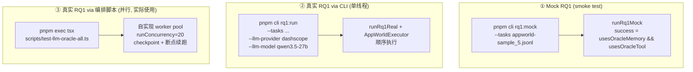

## 完整实验流程（端到端）

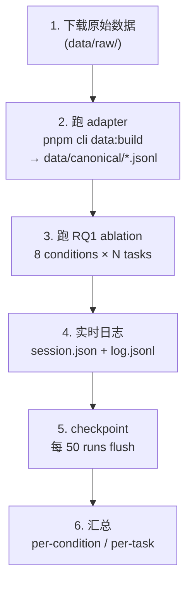

---

# 配置文件与构建

## 配置文件

| 文件 | 用途 |
|---|---|
| `package.json`（root） | `name=context-prologue`, `version=0.1.0`, `private=true`, `type=module`, `packageManager=pnpm@9.15.0`。scripts: `build`/`typecheck`/`test`/`cli` |
| `pnpm-workspace.yaml` | `packages: ["packages/*"]` |
| `tsconfig.base.json` | ES2022 / NodeNext / strict / declaration+sourceMap / resolveJsonModule |
| 各包 `tsconfig.json` | 继承 base，`rootDir: src, outDir: dist` |
| `.env`（gitignored） | API keys（DashScope 等），`loadEnvIntoProcess()` 加载 |
| `.gitignore` | `node_modules/`, `dist/`, `.env`, `.venv-appworld/`, `data/raw/`, `runs/` |

## 构建流程

```bash
pnpm install         # 安装 workspace 依赖
pnpm build           # 按 topological 顺序跑各包 tsc -p tsconfig.json
pnpm typecheck       # build + 各包 --noEmit
pnpm test            # 各包 vitest run --passWithNoTests
```

**构建顺序**（`pnpm -r --sort build`）：schemas → log → session → common → data → prologue → experiments → cli

---

# 当前实验进度

| 维度 | 状态 |
|---|---|
| AppWorld adapter (v0.2.0) | ✅ 完成 |
| BFCL V4 Memory adapter (v0.1.0) | ✅ 完成（465 tasks） |
| RQ1 mock runner | ✅ 完成 |
| RQ1 real executor（stub + LLM agent） | ✅ 完成 |
| Per-app token 隔离 / 敏感字段 redaction | ✅ 完成 |
| 并行编排 + checkpointing + provider_error 分离 | ✅ 完成 |
| vLLM provider + 环境变量路径配置 | ✅ 完成 |
| 5-task smoke run（qwen3.5-27b / 35b-a3b） | ✅ oracle_all > baseline（+0.14 / +0.10） |
| 10-task smoke2（qwen3.5-27b，maxSteps=600 + STRICT prompt） | ✅ oracle_all 0.83 vs baseline 0.76（+0.08） |
| **batch_a 全量 147×8=1176 runs（qwen3.5-27b）** | ✅ **完成** — oracle_all 0.748 vs baseline 0.692（+8.1%） |
| BFCL V4 RQ1 全量实验 | ❌ 未开始（adapter + executor 已就绪） |
| RQ2 Prologue 方法 | ❌ 未开始 |
| RQ3 训练式 Verifier | ❌ 未开始（接口已定义） |
| RQ4 跨 benchmark 泛化 | ❌ 未开始 |
| τ²-bench / MemoryAgentBench adapter | ❌ 未开始 |

## 测试基础设施

- **框架**：vitest `^2.1.8`
- 每个包 `package.json`：`"test": "vitest run --passWithNoTests"`
- 仅 `@prologue/experiments` 有真实测试（3 文件，13 测试）：
  - `rq1.test.ts` — `buildRq1Input` 行为验证（baseline = common memory only，oracle_memory = common + oracle，旧 task fallback）
  - `appworld_http.test.ts` — URL 构建 / per-app token 隔离 / explicit token 优先
  - `appworld_llm_agent.test.ts` — per-app token 存储，敏感字段 redaction
- 全量 `pnpm test`：13/13 通过
